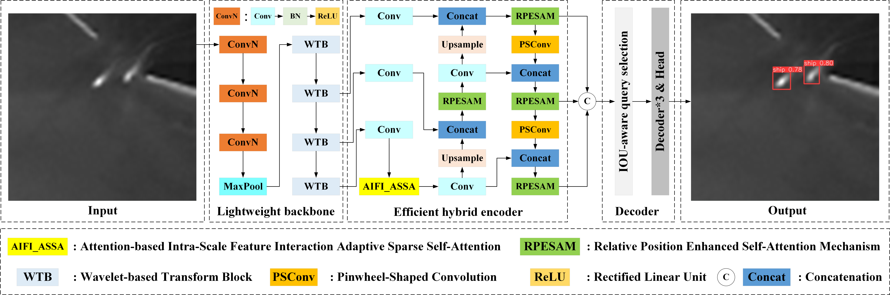

# IRSD-DETR
IRSD-DETR

We have provided the testing code and dataset to facilitate the review of our work.

(1) Both can be accessed via the following Baidu Drive link: [Baidu Drive Download here](https://pan.baidu.com/s/1p0tqtneRkNYh1NvJicBnSg?pwd=94k3). Access Code: 94k3

(2) Both can be accessed via the following Google Drive link: [Google Drive Download here](https://drive.google.com/drive/folders/1CPl_neXD_bC2TZKs7fj9it88RCisilgO?usp=sharing).

To verify our results, please run the val.py script after installing the necessary dependencies via requirements.txt.

# IRSD-DETR: A lightweight real-time detection transformer for infrared ship detection

## Abstract
Infrared ship detection (IRSD) plays an important role in many applications such as thermal remote sensing for maritime safety and surveillance. However, its detection performance often degrades due to small target sizes, insufficient feature extraction and complex background interference, leading to frequent false alarms and missed detections. In addition, existing detection transformer (DETR)-based models suffer from heavy network parameters and high computational complexity. To solve these issues, we propose a lightweight real-time detection transformer for IRSD, termed IRSD-DETR.

## Overview of IRSD-DETR


## Publication
```
If you want to use this work, please consider citing the following paper.
@article{ge2026irsd,
  title={IRSD-DETR: A lightweight real-time detection transformer for infrared ship detection},
  author={Ge, Pengqiang and Gu, Guohua and Qian, Weixian and Kong, Xiaofang and Chen, Qian and Wan, Minjie},
  journal={ISPRS Journal of Photogrammetry and Remote Sensing},
  volume={236},
  pages={239--254},
  year={2026},
  publisher={Elsevier}}
```
